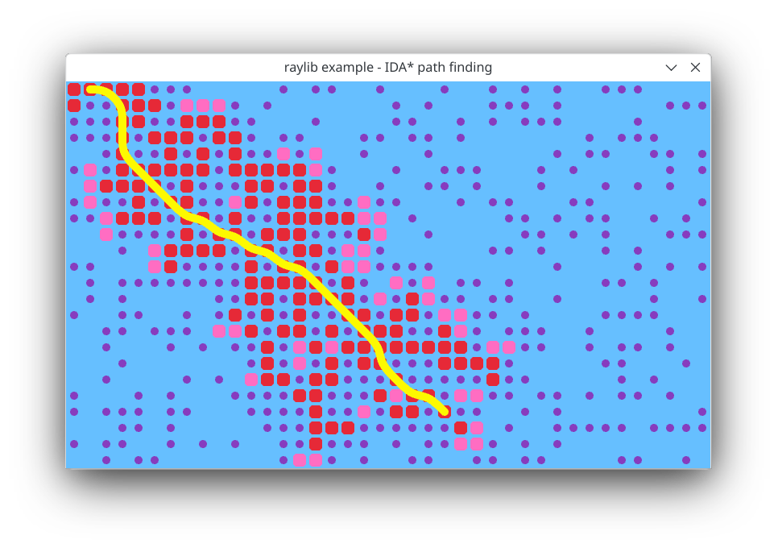
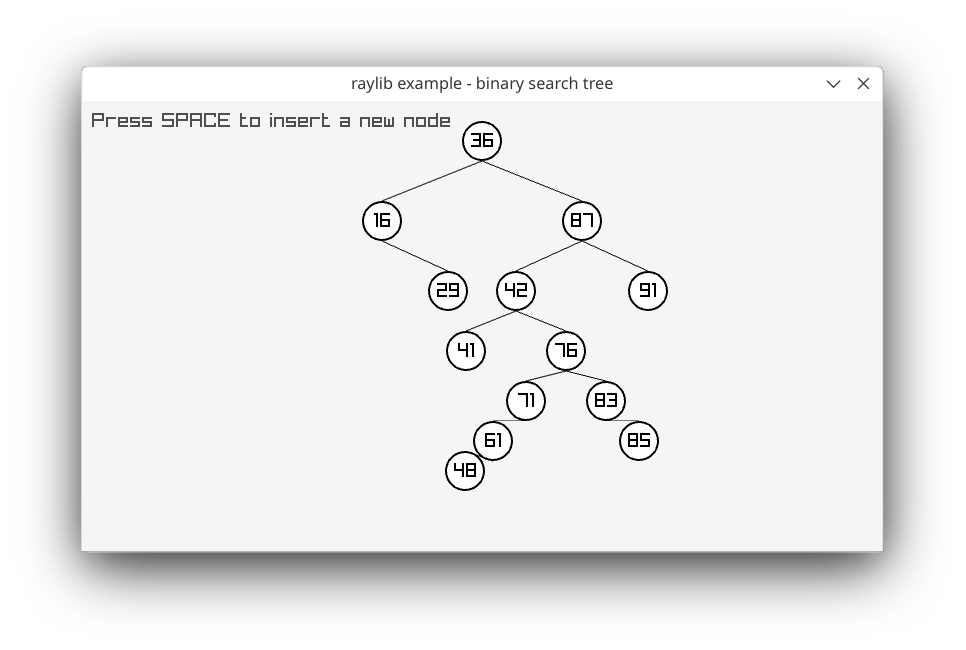
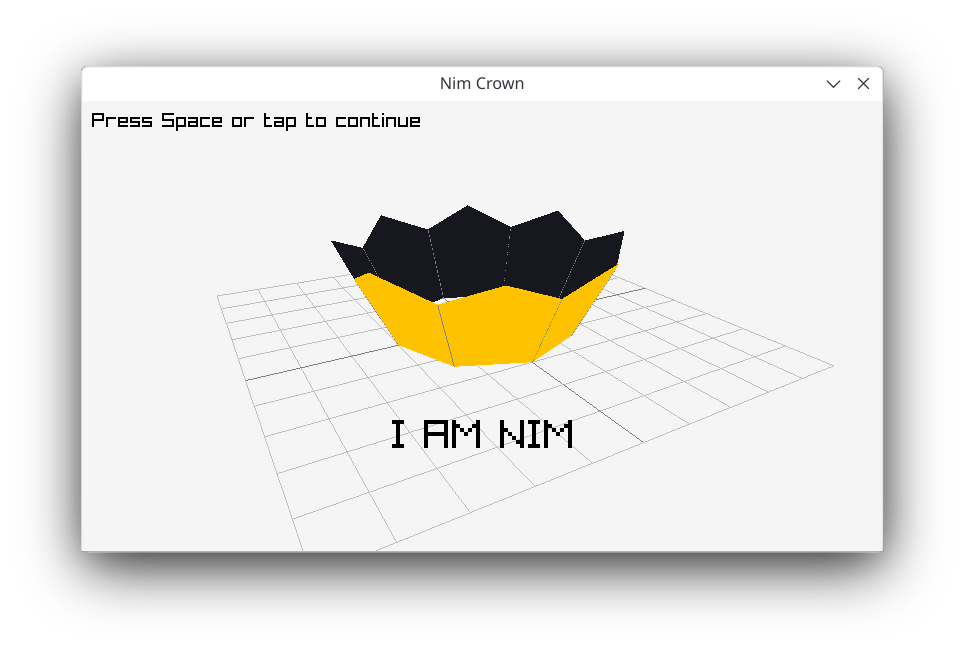
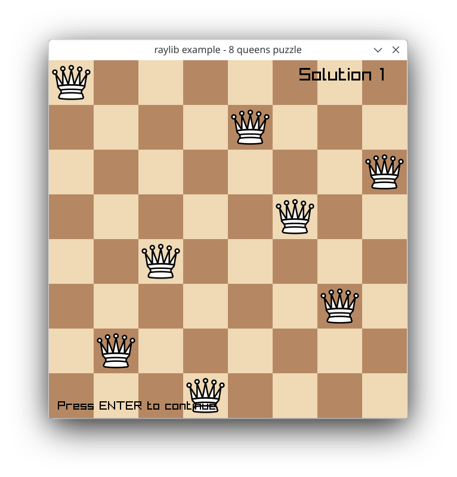
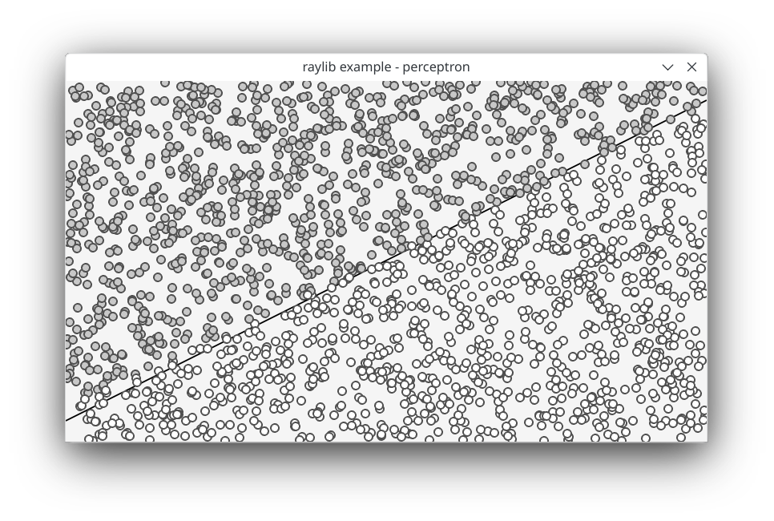
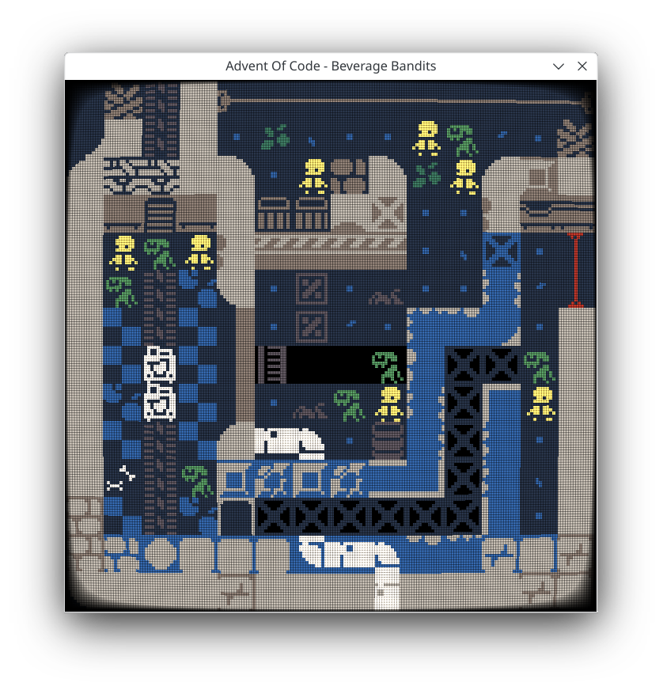
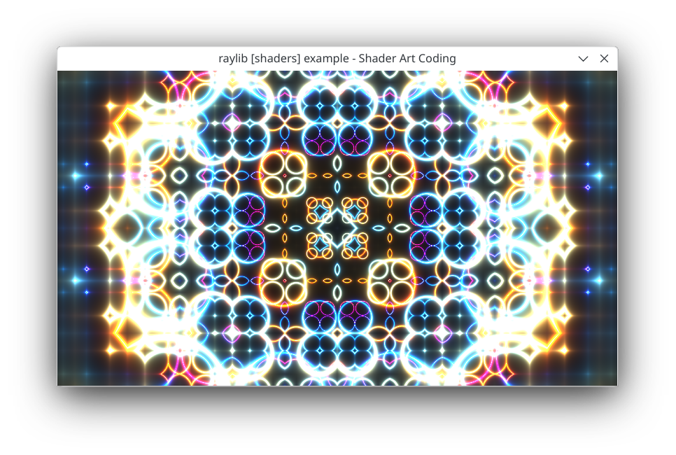
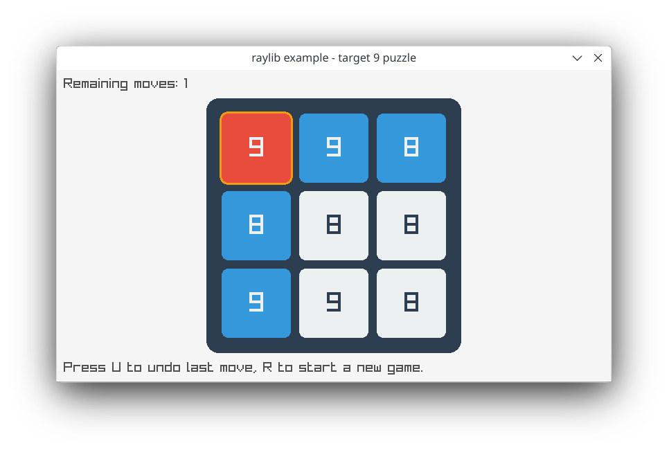

# raylib-examples ported to Nim

This repository contains [raylib](https://www.raylib.com/) examples ported to the [Nim programming language](https://nim-lang.org/). It also includes unique examples built with [naylib](https://github.com/planetis-m/naylib) from the start.

## Unique naylib Examples

### A* (IDA*) Path Finding
**File:** [astar.nim](personal/astar.nim)

This example demonstrates the IDA* (Iterative Deepening A*) path finding algorithm. It's an efficient way to find the shortest path between two points in a graph or grid.

### Binary Search Tree
**File:** [bst.nim](personal/bst.nim)

An implementation and visualization of a binary search tree data structure. This example helps in understanding tree traversal and basic operations on a BST.

### Nim Crown
**File:** [crown.nim](personal/crown.nim)

A creative example that draws a crown using raylib's drawing functions, paying homage to the Nim programming language.

### 8 Queens Puzzle
**File:** [nqueens.nim](personal/nqueens.nim)

This classic chess puzzle challenges you to place eight queens on a chessboard so that no two queens threaten each other. The example provides a solver and visualization.

### Raylib Perceptron
**File:** [perceptron.nim](personal/perceptron.nim)

An implementation of a simple perceptron, demonstrating basic concepts of neural networks and machine learning using raylib for visualization.

### Rogue (Advent of Code Solution)
**File:** [rogue.nim](personal/rogue.nim)

This example is a solution to the "Beverage Bandits" problem from Advent of Code 2018, Day 15. It implements a rogue-like game simulation.

[Problem Link](https://adventofcode.com/2018/day/15)

### Shader Art Coding
**File:** [shaderart.nim](personal/shaderart.nim)

An introduction to Shader Art Coding, based on the YouTube tutorial by @kishimisu. This example demonstrates how to create interesting visual effects using shaders.

[Tutorial Video](https://youtu.be/f4s1h2YETNY)

### Target 9 Puzzle Game
**File:** [target9.nim](personal/target9.nim)

A puzzle game where the objective is to change all digits on a 3x3 grid to 9 by incrementing the values in selected rows and columns.

## Contributing

We welcome contributions to this repository! If you have created an interesting
example using raylib/naylib and Nim, feel free to submit it. Please ensure your
code is well-commented and follows the existing style guidelines.

## License

This project is licensed under the [MIT License](LICENSE).

---

Happy coding with raylib and Nim!
